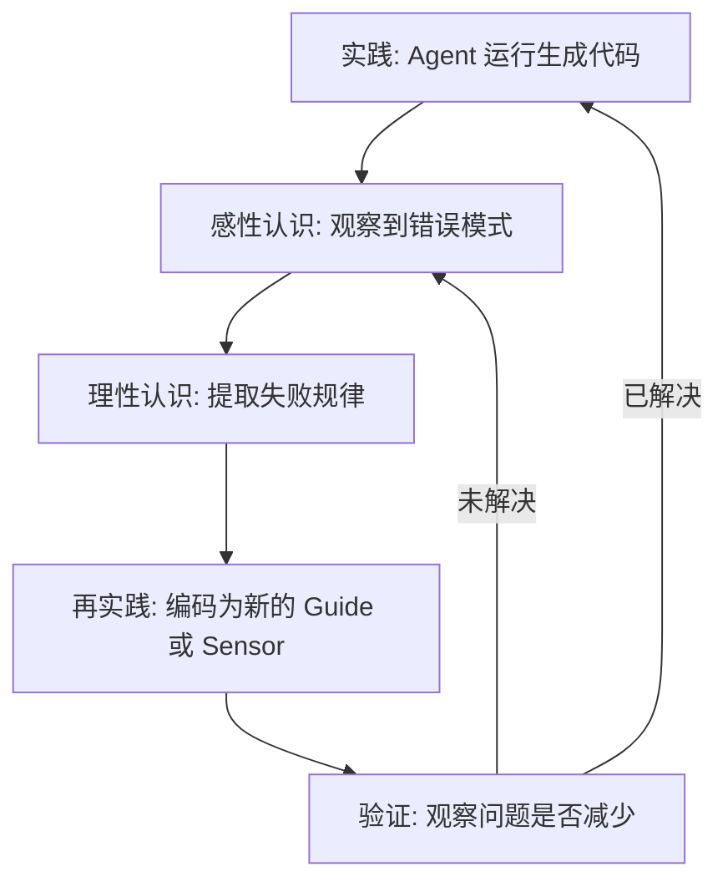

# 📕 矛盾与代码：Harness Engineering 的方法论解析

   

> *"你要有知识，你就得参加变革现实的实践。你要知道梨子的滋味，你就得变革梨子，亲口吃一吃。"* > —— 《实践论》

## 💡 这是什么？

从 Andrej Karpathy 提出的 **Vibe Coding**（交出键盘，完全沉浸于氛围）到 OpenAI 提出的 **Harness Engineering**（设计约束系统），AI 辅助编程正在经历一次认识论上的范式转换。

核心公式：**`Agent = Model + Harness`**

* **Model（马）：** 提供强大的生成能力。
* **Harness（缰绳、辔头和马鞍）：** 模型之外的一切——指令、上下文、工具、运行时、验证机制。

本项目/文章致力于探讨：从"直接写代码"到"设计约束系统"的转变，如何与**毛泽东方法论**（实践论、矛盾论、民主集中制等）在结构上产生精确的等价映射。这是一次严肃的方法论移植实验。

---

## 📑 目录

- [一、Harness 的双重结构：纲领与传感](#一-harness-的双重结构纲领与传感)
- [二、认识的螺旋：Steering Loop](#二-认识的螺旋steering-loop)
- [三、矛盾分析法：Agent 与 Model 的张力](#三-矛盾分析法agent-与-model-的张力)
- [四、组织原则：代码库的民主集中制](#四-组织原则代码库的民主集中制)
- [五、调查研究：Harnessability](#五-调查研究harnessability)
- [六、战略阶段论：演进路线](#六-战略阶段论演进路线)
- [七、参与贡献与实践检验](#七-参与贡献与实践检验)

---

## 一、 Harness 的双重结构：纲领与传感

Harness 的构件分为两类，缺一不可。这与组织方法论中的“前馈”与“反馈”高度对应。

| Harness 机制 | 工程表现 (Thoughtworks 分类) | 方法论对应 | 作用 |
| :--- | :--- | :--- | :--- |
| **Guide (前馈/引导)** | `AGENTS.md` / `CLAUDE.md`, 架构原则, 参考应用, MCP 工具 | **纲领、方针、政策** | 在 Agent 行动前预判并引导其行为（规定方向与边界）。 |
| **Sensor (反馈/传感)** | Linter, 类型检查, 测试套件, AI Code Review, LLM as judge | **调查研究 + 批评与自我批评** | 在 Agent 行动后观测结果并触发自我修正。 |

> **⚠️ 注意：计算性 vs 推理性 Sensor** > Linter 是**计算性**的（确定性、低成本），LLM as Judge 是**推理性**的（语义强但概率性）。两者是矛盾的不同方面，覆盖结构性与语义性问题，不可盲目互换。

---

## 二、 认识的螺旋：Steering Loop

Harness Engineering 的核心工作循环是 **Steering Loop**，它是《实践论》“实践→认识→再实践”的精确工程化实例。

### ❌ 两种典型反模式：
- **教条主义（过度前馈）：** 试图在实践前写出完美的、几百行的 `AGENTS.md`，导致上下文溢出。
- **经验主义（纯 Vibe Coding）：** 遇到问题手动修复，从不将规律沉淀为 Harness 规则。

---

## 三、 矛盾分析法：Agent 与 Model 的张力

`Agent = Model + Harness` 本身是一个矛盾统一体。Harness 约束太多压制模型能力，太少则输出失控。

### Harness 的三层矛盾管控

1. **🛠️ 可维护性 (Maintainability)**
   * **目标：** 内部质量（重复代码、复杂度）。
   * **主要矛盾：** 结构性。靠计算性 Sensor 解决。
2. **⚙️ 架构适配性 (Architecture Fitness)**
   * **目标：** 非功能性特征（性能、安全）。
   * **主要矛盾：** 混合型。需结合计算性（基准测试）与推理性（诊断）。
3. **🎯 行为正确性 (Behaviour)**
   * **目标：** 功能是否符合人类真实需求。
   * **主要矛盾：** 需求定义。*如果没有清晰定义想要什么，没有任何 Sensor 能检测正确性偏差。*

---

## 四、 组织原则：代码库的民主集中制

* **民主（生成自由度）：** Agent 在约束边界内拥有充分的实现自由（不规定变量命名等微观细节）。
* **集中（硬约束）：** 架构分层、类型检查、测试绿灯。不可跨越的纪律。

> 💡 **核心推论：** Harness 中 Sensor 的强度与 Guide 中 Prompt 的简洁性成正比。检验机制越强，你越敢给 Agent 自由。

---

## 五、 调查研究：Harnessability

> *"没有调查就没有发言权。"*

在建设 Harness 之前，必须进行三个层次的调查：
1. **问题域调查：** 用户是谁？核心场景是什么？边界在哪？（行为 Harness 的前提）
2. **工具调查：** 当前模型的能力边界在哪？（需要设计能力探针 Probe）
3. **可 Harness 性调查 (Harnessability)：** 现有代码库的框架、语言生态是否对 Linter / 测试友好？

---

## 六、 战略阶段论：演进路线

项目在不同阶段的主要矛盾不同，Harness 的策略必须随之演进：

### 🗺️ 阶段 1：战略探索 (建基础)
* **主要矛盾：** 认识不足。
* **任务：** 搭 CI 骨架，用探针摸底模型能力，写极简版 `AGENTS.md`。

### 🏗️ 阶段 2：战略相持 (造功能)
* **主要矛盾：** 功能复杂性 vs 单次生成能力。
* **任务：** Harness 与功能代码同步增长。每增加一个功能，必须配上对应的 Sensor（测试/规则）。

### 🚀 阶段 3：战略收官 (保质量)
* **主要矛盾：** 质量是否达标。
* **任务：** 升级重型 Sensor（端到端测试、变异测试、安全审计），利用 Agent 批量生成测试和文档。

---

## 🛑 方法论的边界与限制

* **适用范围：** 中高复杂度、需要多日开发和决策权衡的项目。简单任务无需如此重装上阵。
* **非对抗性语境：** 原始方法论包含敌我对抗假设，本文将其重构为技术协作中的“张力”。
* **领域演进快：** Harness Engineering 尚在快速成长期，请依据最新的 API 和模型能力调整策略。

---

## 🤝 七、参与贡献与实践检验

理论的价值在于经受实践检验。如果你在实际的 Vibe Coding 或 Harness 工程中应用了这套框架，欢迎提交 **Issue** 分享经验：

- ✅ 哪些指导帮助你做出了更好的架构决策？
- ❌ 哪些理念在实际开发中产生了误导或水土不服？
- 🔍 发现了本文未覆盖的核心方法论问题？

### 📚 延伸阅读

* [Harness engineering for coding agent users](https://martinfowler.com/articles/harness-engineering.html) — Birgitta Böckeler, Thoughtworks
* [The Anatomy of an Agent Harness](https://blog.langchain.com/the-anatomy-of-an-agent-harness/) — LangChain
* [Skill Issue: Harness Engineering for Coding Agents](https://www.humanlayer.dev/blog/skill-issue-harness-engineering-for-coding-agents) — HumanLayer

## 许可

本文内容以 [CC BY-SA 4.0](https://creativecommons.org/licenses/by-sa/4.0/) 发布。

| 阶段 | 主要矛盾 | 战略任务 | 核心操作 | 典型错误 / 标志 |
| :--- | :--- | :--- | :--- | :--- |
| **1. 战略探索** | 对问题和工具的**认识不足**。 | **快速积累认识**，而非生产功能代码。 | 用短 prompt 做大量小实验；搭建 Harness 基础骨架。 | **错误**：跳过此阶段直接开发（冒险主义）。 **标志**：能清晰回答 AI 能做什么、不能做什么。 |
| **2. 战略相持** | 功能复杂性与 AI 单次生成能力之间的矛盾。 | **稳步推进功能开发**，持续强化 Harness。 | 聚焦可验证的功能增量；Harness 与功能代码同步增长。 | **错误**：反复重构（说明还在第一阶段）；Harness 停滞。 |
| **3. 战略收官** | **质量**是否达标。 | **系统性质量保障**。 | 端到端测试覆盖；性能基准测试；安全审计；让 AI 批量生成并自动过滤。 | **特征**：依靠强约束的 Harness 释放 AI 的批量生产力。 |

---

## 六、一条贯穿性的线索：认识如何固化为制度

**每一次实践-认识循环的成果，都应该被固化为制度性的约束，而不是停留在个人经验中。**

* 发现并发逻辑遗漏边界 → 转化为 lint 规则/测试模板。
* 发现有效 prompt 结构 → 转化为团队共享 prompt 模板。
* 发现某类代码需人工审查 → 转化为代码审查协议条款。

Vibe coding 的长期成败，不取决于单次 prompt 的巧妙程度，而取决于你是否建立了一个随实践不断进化的**制度性认识体系**。

---

## 七、方法论的边界

* **适用范围：** 适合中等及以上复杂度、涉及不确定性和决策权衡的 vibe coding 项目。简单确定性任务不需要此框架。
* **原始语境：** 将原著中的“对抗性”假设（敌我矛盾）在技术语境下重新阐释为“张力”。
* **避免过度诠释：** 未触及“阶级分析”等在技术语境下缺乏非牵强对应物的概念。

---

## 八、实践检验

理论的价值在于能否经受实践的反复检验。

如果你在实践中运用了以上方法论框架，欢迎通过 Issue 报告：
* ✅ 某条指导在什么场景下帮助做出了更好决策？
* ❌ 某条指导在什么场景下不适用或产生误导？
* 💡 发现了本文未覆盖的、重要的方法论问题？

 

📝 **许可:** 本文内容以 [CC BY-SA 4.0](https://creativecommons.org/licenses/by-sa/4.0/) 发布。
